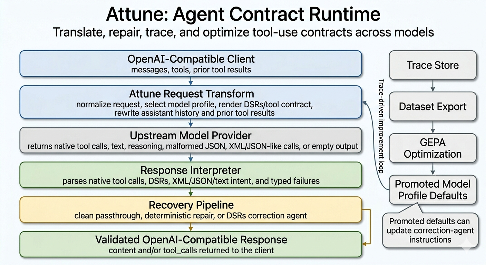

# Attune

> **MVP under active construction.** Attune is usable for local experiments,
> trace-driven development, and early model-profile work, but the public API,
> configuration surface, datasets, evals, and built-in defaults are still
> moving. Current comparison numbers are directional engineering evidence, not
> final benchmark claims.

Attune is an **Agent Contract Runtime** for reliable tool use across
OpenAI-compatible models.

The name reflects the runtime loop: **A**daptive **T**ool-use
**T**ranslation, **U**nderstanding, **N**ormalization, and **E**valuation.

Attune sits between an existing OpenAI-compatible client and an upstream model
provider. It makes tool use an explicit, inspectable, model-specific contract
instead of assuming the provider's native tool parser, chat template, or
inference stack will preserve the model's intent.



The first target is agent tool-calling reliability for open-source and
OpenAI-compatible models. When a model clearly intends to call a tool but the
provider returns plain text, malformed JSON, an empty stop, reasoning-only
output, or a non-OpenAI tool shape, Attune can translate, interpret, repair,
trace, and evaluate that turn before the client application loop breaks.

Attune is not a smarter coding agent, and it does not try to judge whether a
model made the best engineering decision. It focuses on the contract boundary:
given the model's agency, keep the assistant turn structurally usable by an
OpenAI-compatible agent harness.

The thesis is simple: many models already know what action they want to take,
but the model/provider/client boundary often fails to carry that action across.
Attune makes that boundary explicit, observable, repairable, and learnable.

## The Problem

Many open-source models are much more capable than their integration
experience suggests. A common failure mode is not that the model cannot use a
tool. It is that the surrounding API, chat template, provider, or inference
engine fails to preserve the model's intended tool call.

Typical symptoms:

- the model says "I'll read the file now" and stops without a tool call
- malformed JSON causes native tool parsing to fail
- a model emits a clear tool call in text, but the client expects OpenAI
  `tool_calls`
- reasoning/thinking fields contain text the client expects in `content`
- a provider reports `finish_reason = stop` even though the response looks like
  an incomplete or misplaced tool call

Most agent harnesses only see one thing: an OpenAI-compatible assistant
message. If that message has neither usable `content` nor valid `tool_calls`,
the loop stops, repeats itself, or loses the model's intended action.

## What Makes Attune Different

Attune is deliberately more than a proxy with a few parser fallbacks:

- **Proxy-owned contracts:** Attune can strip native upstream tools, render a
  DSRs-style contract, and parse model text back into OpenAI `tool_calls`.
- **Model profiles:** Qwen, Gemma, Kimi, GLM, Llama, and unknown fallback
  models can use different history renderers, tool guidance, correction
  settings, provider routing, and optimized prompt artifacts.
- **Conversation-aware formatting:** Prior assistant tool calls and tool
  results are reformatted into the selected contract. Attune does not only
  rewrite the latest prompt; it keeps the full conversation history aligned
  with the format the model is expected to use now.
- **Layered recovery:** The runtime separates deterministic interpretation,
  schema repair, policy decisions, and a typed DSRs correction-agent fallback
  instead of mixing one-off fixes into one parser. Deterministic repair handles
  clear syntax/schema problems; ambiguous or semantic recovery goes through a
  typed correction agent.
- **Trace-to-dataset loop:** Traces are rich enough to inspect failures after
  the fact, export exact request-adapter or correction-agent dataset rows,
  replay regressions, and run GEPA prompt optimization. Every meaningful
  failure should be able to become a regression case or training row.
- **Explicit promotion:** Optimized artifacts are reviewed, promoted into
  profile config, and then promoted into embedded built-in defaults only when
  they should ship with the binary.

The design goal is that any OpenAI-compatible app can point at Attune, choose
any model string, and get the best known contract adapter for that model.
Unknown models receive shared defaults; known model families can accumulate
their own traces, datasets, GEPA artifacts, and profile revisions over time.

## MVP Status

The original planning docs described this work in phases. The public MVP now
covers the core runtime, model-profile, tracing, dataset, evaluation, GEPA, and
artifact-promotion loop. The remaining work is hardening, broadening model
coverage, and improving release ergonomics.

Implemented now:

- OpenAI-compatible `/v1/chat/completions`, `/v1/models`, and `/health`
- request normalization, model profile selection, and generic
  OpenAI-compatible upstream calls
- proxy-owned DSRs tool rendering, including profile-selectable conversation
  history formats
- native, DSRs, XML, tagged JSON, markdown JSON, direct JSON, and
  function-like tool-intent interpretation
- deterministic syntax/schema repair, parallel-tool enforcement, and a typed
  DSRs correction-agent fallback
- JSONL request traces and correction-agent sidecar traces
- trace inspection, replay, regression evaluation, and trace-harness comparison
  against direct baseline
- request-adapter and correction-agent dataset export
- GEPA optimization for request-adapter profile guidance and correction-agent
  prompts
- explicit artifact promotion into config, then embedded built-in defaults for
  shipped binaries
- reviewed built-in request-adapter defaults for Qwen and Gemma profiles

Attune intentionally buffers upstream chat completions so it can interpret and
repair the complete output before returning a client-compatible response. If
the client requests `stream: true`, it returns a corrected SSE response after
buffering and repair; it does not yet proxy upstream tokens incrementally.

## Early Evidence

The strongest fresh comparison result so far is the reviewed 500-scenario
Pi/Hermes trace-harness run against `google/gemma-4-26b-a4b-it` on OpenRouter:

| Path | Structural passes |
| --- | ---: |
| Direct OpenRouter baseline | 475/500 |
| Attune proxy | 497/500 |

Attune fixed all 25 direct baseline structural failures. The 3 proxy
regressions from that run were reviewed and added to the curated GEPA datasets.

Qwen is currently flagged as the highest-priority in-progress profile. Earlier
Qwen 3.5 9B runs showed strong practical improvement in live Pi testing, but
the latest 500-scenario curation run exposed request-adapter and correction
agent gaps that should not be marketed as solved yet:

| Qwen 3.5 9B curation run | Count |
| --- | ---: |
| Direct baseline structural passes | 487/500 |
| Attune proxy structural passes | 457/500 |
| Baseline failures fixed by Attune | 13 |
| Proxy regressions to learn from | 43 |

Those Qwen regressions were reviewed by category: premature action without a
tool call, tool-like text without OpenAI `tool_calls`, unrecovered fallback
responses, and correction-agent failures. Representative cases were promoted
into the Qwen request-adapter dataset and the correction-agent dataset so the
next GEPA pass can train directly against them. Treat Qwen as actively under
optimization until that rerun lands.

## Try It

Start with embedded built-in profile defaults:

```sh
cp .env.example .env
export OPENROUTER_API_KEY="..."
nix develop --command cargo run --
```

Then point any OpenAI-compatible client at:

```text
http://127.0.0.1:8080/v1
```

Known Qwen and Gemma model strings use reviewed built-in request-adapter
defaults. Unknown models fall back to `balanced-default`, which still uses the
shared DSRs contract, trace, repair, and correction pipeline.

For full commands, examples, GEPA runs, artifact promotion, trace-harness
comparisons, and live OpenRouter smoke tests, see
[`docs/command-reference.md`](docs/command-reference.md).

## Architecture

```text
Client application
  -> OpenAI-compatible proxy endpoint
    -> request normalizer
    -> model profile resolver
    -> prompt/tool adapter
    -> upstream OpenAI-compatible model call
    -> response interpreter
    -> repair / correction pipeline
    -> trace store
  -> OpenAI-compatible response
```

Main source areas:

| Component | Source | Purpose |
| --- | --- | --- |
| Gateway | `src/gateway.rs` | Axum HTTP server exposing `/health`, `/v1/models`, and `/v1/chat/completions` |
| OpenAI types | `src/openai.rs` | OpenAI-compatible request/response structures |
| Model profiles | `src/model_profile.rs` | Model-specific tool rendering and repair defaults |
| Prompt adapter | `src/prompt_adapter.rs`, `src/dsrs_contract.rs` | Proxy-owned DSRs request rendering |
| Response interpreter | `src/response_interpreter.rs` | Detects native, DSRs, XML, JSON, and text tool intent |
| Repair engine | `src/repair.rs` | Repairs tool names, JSON arguments, schema shape, and policy violations |
| Correction agents | `src/agents.rs` | Typed DSRs correction-agent path for suspicious malformed responses |
| Traces/datasets/eval | `src/trace.rs`, `src/dataset.rs`, `src/replay.rs`, `src/eval.rs`, `src/trace_harness.rs` | Trace, replay, dataset, and evaluation workflows |
| Optimization/promotion | `src/optimization.rs`, `src/promotion.rs`, `build.rs` | GEPA artifacts and built-in default promotion |

## DSRs Request Transform

In proxy-owned DSRs mode, the client can send a normal OpenAI-compatible
request:

```jsonc
{
  "model": "qwen/qwen3.5-9b",
  "messages": [
    {"role": "system", "content": "You are a coding agent."},
    {"role": "user", "content": "Read Cargo.toml"},
    {
      "role": "assistant",
      "content": "",
      "tool_calls": [
        {
          "id": "call_1",
          "type": "function",
          "function": {
            "name": "read",
            "arguments": "{\"path\":\"Cargo.toml\"}"
          }
        }
      ]
    },
    {
      "role": "tool",
      "tool_call_id": "call_1",
      "content": "[package]\nname = \"attune\""
    },
    {"role": "user", "content": "What is this project?"}
  ],
  "tools": [
    {
      "type": "function",
      "function": {
        "name": "read",
        "description": "Read file contents",
        "parameters": {
          "type": "object",
          "required": ["path"],
          "properties": {"path": {"type": "string"}}
        }
      }
    }
  ],
  "tool_choice": "auto",
  "parallel_tool_calls": false
}
```

Attune selects a model profile, removes native upstream tool definitions for
proxy-owned profiles, and renders the request into a DSRs contract. In the
default `append_only` history format, the upstream model sees a runtime context
first, followed by append-only conversation messages:

```text
system:
  You are an OpenAI-compatible assistant behind Attune.
  Produce exactly these DSRs output fields:
  - content: plain user-facing text
  - tool_calls: JSON array of {"name": string, "arguments": object}
  Use [] when no tool call is needed.
  If parallel_tool_calls is false, emit at most one tool call.

user:
  [[ ## profile_guidance ## ]]
  <model/profile-specific guidance or promoted GEPA artifact>

  [[ ## system_context ## ]]
  role: system
  content:
  You are a coding agent.

  [[ ## conversation ## ]]
  Append-only conversation follows as chat messages.

  [[ ## available_tools ## ]]
  [
    {
      "type": "function",
      "function": {
        "name": "read",
        "description": "Read file contents",
        "parameters": {"type": "object", "...": "..."}
      }
    }
  ]

  [[ ## tool_choice ## ]]
  "auto"

  [[ ## parallel_tool_calls ## ]]
  false

  The remaining chat messages are append-only conversation history. Prior
  assistant messages use the same DSRs content/tool_calls output format you
  must use now. Tool-result messages may use a tool_result field marker and
  are observations, not an output field you should emit.

user:
  Read Cargo.toml

assistant:
  [[ ## content ## ]]

  [[ ## tool_calls ## ]]
  [
    {"name": "read", "arguments": {"path": "Cargo.toml"}}
  ]
  [[ ## completed ## ]]

user:
  [[ ## tool_result ## ]]
  tool_call_id: call_1
  content:
  [package]
  name = "attune"
  [[ ## completed ## ]]

user:
  What is this project?
```

The model must answer with the same output shape:

```text
[[ ## content ## ]]
This is a Rust proxy/runtime for adapting OpenAI-compatible tool use across
models.

[[ ## tool_calls ## ]]
[]

[[ ## completed ## ]]
```

Content-only, tool-calls-only, and content plus tool calls are all valid. Empty
content with empty `tool_calls` is not useful to an agent loop, so Attune treats
that as a structural failure and routes it through recovery.

`append_only` is the default because it preserves normal multi-turn chat shape
while making prior assistant/tool turns teach the current DSRs contract. Attune
also keeps a `regenerated_context` format for profiles that behave better when
the whole non-system conversation is serialized into one compact transcript.

## Core Concepts

**Proxy-owned DSRs contracts:** Attune can consume OpenAI-style `tools`, remove
native upstream tool definitions, render the request into a model-friendly DSRs
contract, then parse the model's text back into OpenAI `tool_calls`. Pass-through
repair remains available for compatibility.

**Model profiles:** Built-in profiles currently cover Qwen, Kimi, GLM, Llama,
Gemma, and a balanced fallback. Profiles can also be supplied through config
files and can load request-adapter or correction-agent artifacts. Built-in
defaults are generated from [`profiles/builtin-defaults.toml`](profiles/builtin-defaults.toml)
at build time and embedded into shipped binaries.

**Repair and correction:** Deterministic repair handles clear syntax/schema
issues such as malformed JSON, near-match tool names, simple schema key typos,
scalar/array shape issues, and misplaced tool-call text. Suspicious stops,
invalid DSRs `tool_calls`, empty outputs, reasoning-only assistant stops, and
semantic recovery cases can route through a typed DSRs correction agent.

**Traceability:** Request traces and correction-agent sidecar traces capture the
original request, selected profile, adapted upstream request, raw upstream
response, parser events, repair actions, correction attempts, and final
response. Traces can contain prompts, model outputs, file paths, and tool
arguments, so treat them as sensitive application data.

**GEPA optimization:** Correction-agent prompts and request-adapter profile
guidance are optimized separately. GEPA artifacts are not applied implicitly:
they are inspected, promoted into profile config, and then promoted into
embedded built-in defaults only when they should ship.

## Documentation

If the README hook is enough and you want the machinery, start here:

- [Command and workflow reference](docs/command-reference.md): how to run the
  proxy, inspect traces, export datasets, run GEPA, promote artifacts, compare
  against direct baseline, and reproduce the live workflows used so far.
- [Configuration reference](docs/config-reference.md): how runtime config,
  model profiles, provider routing, environment variables, and artifact
  references are resolved.
- [Model configurability](docs/model-configurability.md): the deeper
  architecture behind shared vs model-specific behavior, request-adapter GEPA,
  correction-agent GEPA, hidden labels, profile revisions, and promotion.
- [Trace harness](eval/trace-harness/README.md): how third-party agent traces
  become neutral OpenAI-compatible scenarios for direct-baseline vs Attune
  comparisons.
- [Built-in defaults](profiles/README.md): how reviewed GEPA artifacts become
  embedded defaults in shipped binaries.
- [Development guide](docs/development.md): contributor workflow, project
  layout, adding repairs, adding profiles, and adding evaluation coverage.

## Current Limitations

- Upstream token streaming is not implemented. Upstream responses are buffered,
  then optionally returned to streaming clients as corrected SSE.
- API coverage is intentionally small: `/health`, `/v1/models`, and
  `/v1/chat/completions`.
- Runtime configuration supports config files and prompt artifacts, but the
  parser/repair policy schema is still a first pass and not every future
  per-model knob is exposed yet.
- Built-in default artifacts are embedded at build time, but promotion is still
  a manual review step.
- Retry/continue policy is represented in configuration but not implemented as
  an upstream retry loop yet.
- Provider-specific adapters beyond generic OpenAI-compatible HTTP are not
  implemented yet.

## License

Attune is published under the MIT License. See [`LICENSE`](LICENSE).

## Roadmap

Near-term directions:

- rerun the Qwen 500-scenario baseline comparison with aligned proxy/harness
  timeouts
- harden config-file validation and parser/repair policy configuration
- add profile validation and migration tooling
- expand trace-harness and GEPA datasets across more model families
- add provider-specific compatibility adapters where generic OpenAI-compatible
  HTTP is not enough
- improve streaming fidelity for corrected responses
- add debug endpoints or a trace inspection UI

Long-term, Attune should become a compatibility runtime that learns how each
model prefers to be prompted, how it tends to fail, and how best to recover
without requiring client applications to change.
